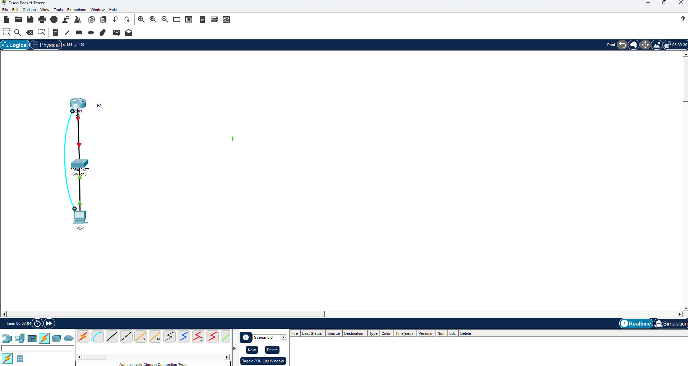

# Cisco Router Basic Configuration

## Overview

This lab demonstrates the initial configuration of a Cisco router using the Cisco IOS Command-Line Interface (CLI).

The router was accessed through a console connection and configured with basic device settings, password protection, console authentication, an MOTD banner, and VTY access using Telnet.

> **Note:** Telnet is used in this lab for learning VTY configuration. SSH should be used in production environments because Telnet does not encrypt network traffic.

---

## Topology



### Devices

- Cisco 2901 Router — `R1`
- Cisco 2960 Switch
- PC
- Console connection between the PC and router

---

## Objectives

- Access the router through the console port
- Navigate Cisco IOS CLI modes
- Configure the router hostname
- Configure an enable secret
- Enable password encryption
- Disable DNS lookup
- Configure console authentication
- Enable synchronous console logging
- Configure an MOTD banner
- Configure VTY lines
- Enable Telnet access
- Set the router clock
- Verify the configuration
- Save the running configuration

---

## Basic Router Configuration

```cisco
enable
configure terminal

hostname R1
no ip domain-lookup

enable secret enpass
service password-encryption

banner motd #ACCESS TO THIS ROUTER IS NOT ALLOWED!#
```

---

## Console Configuration

```cisco
line console 0
 password conpass
 login
 logging synchronous
 exit
```

`logging synchronous` prevents system messages from disrupting commands being typed in the console.

---

## VTY Configuration

```cisco
line vty 0 15
 password vtypass
 login
 transport input telnet
 exit
```

This configuration enables remote Telnet access to the router through the VTY lines.

---

## Set Router Clock

```cisco
clock set 19:52:00 11 Aug 2026
```

Verify the configured time:

```cisco
show clock
```

---

## Verification

The router configuration was verified using:

```cisco
show running-config
show startup-config
show clock
```

The verification confirmed:

- Hostname configured as `R1`
- Enable secret configured
- Password encryption enabled
- DNS lookup disabled
- Console password authentication enabled
- Synchronous console logging enabled
- VTY lines `0-15` configured
- Telnet enabled on VTY lines
- MOTD security banner configured

---

## Save Configuration

The running configuration was saved to NVRAM:

```cisco
copy running-config startup-config
```

Output:

```text
Destination filename [startup-config]?
Building configuration...
[OK]
```

---

## Troubleshooting & Lessons Learned

During the lab, several commands initially failed because they were entered from the wrong Cisco IOS mode.

### Enable Secret

Incorrect:

```text
R1# enable secret enpass
```

Correct:

```text
R1# configure terminal
R1(config)# enable secret enpass
```

`enable secret` is a global configuration command.

### Logging Synchronous

Incorrect:

```text
R1(config)# logging synchronous
```

Correct:

```text
R1(config)# line console 0
R1(config-line)# logging synchronous
```

`logging synchronous` is configured under line configuration mode.

### Saving Configuration

Incorrect:

```text
R1(config)# copy running-config startup-config
```

Correct:

```text
R1# copy running-config startup-config
```

The `copy` command is executed from privileged EXEC mode.

---

## Cisco IOS Modes Used

```text
R1>                 User EXEC Mode

R1#                 Privileged EXEC Mode

R1(config)#         Global Configuration Mode

R1(config-line)#    Line Configuration Mode
```

Understanding which IOS mode a command belongs to is essential when configuring Cisco devices.

---

## Security Note

The passwords used in this lab are example credentials for Cisco Packet Tracer only and must not be reused in production environments.

Telnet was intentionally configured for learning purposes. SSH should be used for secure remote administration in real networks.
